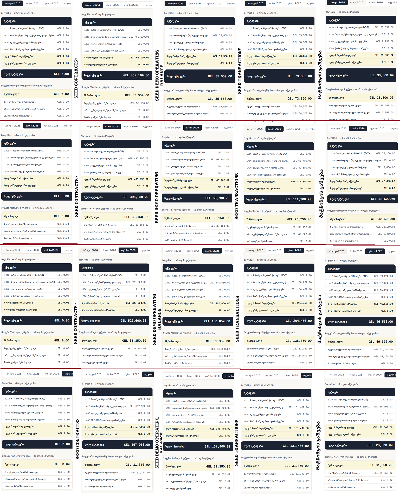

# From reconciliation tool to financial platform

🇬🇪 [ქართული ვერსია](./ARCHITECTURE.ka.md)

**Branch scope:** this document and the `ledger` module it describes are a **recommendation**, not a rewrite. Every requirement in the original assignment still works exactly as it did, just relocated to `/reconciliation`. This branch adds a second, additive layer showing how the codebase could grow into a broader financial platform (invoices, payroll, expenses, general ledger) without a rewrite.

It's intentionally small: a handful of tables, a thin service/hook layer mirroring the existing one, and three pages — Summary (`/`), Chart of Accounts (`/accounts`), Journal (`/journal`) — plus one live action (re-running the same matching mutation the dashboard already has).

**One decision worth calling out:** the ledger's Summary is now the app's default landing page (`/`), not a side door. `AppSidebar` carries a single loud, bordered link — "ეს არის დავალება" ("this is the task") — to `/reconciliation`, where the actual deliverable lives. This makes the branch/task distinction visible on every page, at the cost of the required dashboard no longer being what a reviewer sees first.

---

## 1. Why not just add more tables

Bolting a purpose-specific table onto `bank_transactions`/`contracts` for every new money-moving feature (rent, payroll, invoices) means every "how much money moved" report ends up hand-rolling a `UNION` over tables that were never designed to be unioned.

The fix isn't full double-entry bookkeeping from day one — that's real complexity this assignment doesn't need. It's giving every domain **one shared, append-only place to record "a financial event happened,"** with double-entry as an **optional layer on top**, adopted per event type only when GL-grade reporting is actually needed.

## 2. Proposed schema

Three new, fully additive tables. Nothing here alters `companies`, `contracts`, or `bank_transactions`.

**`financial_events`** — the single source of truth every domain writes to:

```sql
create table financial_events (
  id uuid primary key default gen_random_uuid(),
  source_type text not null,        -- 'bank_transaction' | 'invoice' | 'expense' | 'payroll' | 'manual' | ...
  source_id uuid not null,          -- id of the row in the source domain table
  occurred_at date not null,
  amount numeric(15,2) not null,
  direction text not null check (direction in ('inflow', 'outflow')),
  description text,
  created_at timestamptz not null default now(),
  unique (source_type, source_id)   -- one event per source row, idempotent to re-run
);
```

`source_type` + `source_id` is a soft pointer (not foreign-keyed, since it points at a different table per row) back to whichever domain owns the record. A new domain adds a table plus one adapter that inserts here on the events it cares about — it never touches another domain's tables.

**The optional double-entry layer:**

```sql
create table accounts (
  id uuid primary key default gen_random_uuid(),
  code text unique not null,
  name text not null,
  type text not null check (type in ('asset','liability','equity','revenue','expense')),
  normal_balance text not null check (normal_balance in ('debit','credit')),
  is_active boolean not null default true
);

create table journal_entries (
  id uuid primary key default gen_random_uuid(),
  financial_event_id uuid references financial_events(id),  -- nullable: posting is optional
  entry_date date not null,
  description text
);

create table journal_lines (
  id uuid primary key default gen_random_uuid(),
  journal_entry_id uuid not null references journal_entries(id) on delete cascade,
  account_id uuid not null references accounts(id),
  debit numeric(15,2) not null default 0 check (debit >= 0),
  credit numeric(15,2) not null default 0 check (credit >= 0),
  check (not (debit > 0 and credit > 0))
);
```

`financial_event_id` is nullable because posting to the ledger is something an event *can* trigger, not something it *must*. A transaction can be reconciled and counted in expected-vs-actual without ever becoming a journal entry.

**What this buys:**

| Future feature | Needs to add | Doesn't need to touch |
|---|---|---|
| Invoices | `invoices` table + one adapter | `bank_transactions`, reconciliation UI, ledger schema |
| Payroll | `payroll_runs`/`payroll_lines` + one adapter | everything above |
| "Cash position across every source" | one query over `financial_events` | nothing |
| Trial balance | a query over `journal_lines` grouped by account | nothing — already the right shape |

---

## 3. Module boundaries

Each domain gets its own folder under `src/modules/`, shaped like the existing `services/`+`hooks/`+`components/` split, just namespaced:

```
src/
  modules/
    reconciliation/          # existing bank-vs-contract feature — a barrel re-exporting
      index.ts                #  the current src/components/dashboard, src/hooks, etc.
                                # in place (not physically moved — low risk, same as a
                                # strangler-fig migration)
    ledger/                   # this branch
      types.ts
      services/                # account, journalEntry, accountBalance
      hooks/                   # useAccounts, useJournalEntries, useAccountBalances
      utils/
        computeAccountBalances.ts  # client-side mirror of the account_balances view
      components/
        ChartOfAccountsTable.tsx, JournalEntriesTable.tsx,
        BalanceSheetPanel.tsx, ProfitAndLossPanel.tsx,
        LedgerNav.tsx, LedgerMatchButton.tsx, LedgerSidebar.tsx
      context/
        MatchHighlightContext.tsx  # see section 4
    invoicing/, payroll/       # not built — same shape, next domains would land here
  components/
    layout/
      AppSidebar.tsx           # cross-cutting: LedgerSidebar + the bordered link to
                                 # /reconciliation, mounted once from app/layout.tsx
  app/
    layout.tsx                 # root layout — mounts AppSidebar
    page.tsx                    # ledger Summary (default page)
    accounts/page.tsx, journal/page.tsx
    reconciliation/page.tsx     # the required deliverable, unchanged logic
    ledger/                    # redirect() stubs for old /ledger/* bookmarks
  lib/, types/                 # cross-cutting: supabase client, query provider, shared types
```

**The rule:** a domain module only imports from its own folder and `src/lib`/`src/types` — never another domain's internals. `AppSidebar` living in `src/components/layout/` (not inside `src/modules/ledger/`) follows the same rule: it composes a ledger component with a link to a different domain, so it's cross-cutting, not owned by either module.

---

## 4. How `/` connects to `/reconciliation`

Three ledger pages share `AppSidebar` → `LedgerSidebar` (just the nav) → `LedgerNav`, which also lists not-yet-built domains (customers, invoices, payroll, etc.) as disabled items.

- **Summary** (`/`) — balance sheet + P&L, recomputed client-side per selected month.
- **Chart of accounts** (`/accounts`) — 16 seeded accounts.
- **Journal** (`/journal`) — every posted entry for the selected month, paginated 25/page (a single month can hold a couple hundred entries between contract demand and transaction postings).

All three pages only *read*. The one write path, `LedgerMatchButton`, isn't a second matching implementation — it calls the exact same `useRunAutoMatching` mutation `/reconciliation`'s button calls, rendered in `/`'s own header (top-right, same spot as `/reconciliation`'s copy). Because the button and `LedgerNav`'s "+N" badge are siblings under `app/layout.tsx` rather than parent/child, the "a match just posted" signal travels through `MatchHighlightContext` instead of a prop.

Every journal entry traces back to one of three real events, each posted by a **database trigger** reacting to a row change — never a function call added into application code, so the reconciliation app has no idea the ledger exists:

| Stage | Trigger | Posting | Effect |
|---|---|---|---|
| 1. Contract created | `AFTER INSERT` on `contracts` (`post_contract_demand()`) | `Dr 1410 მოთხოვნები` / `Cr 6000 შემოსავალი`, once per active calendar month | Receivable and revenue rise every month the contract is active, not as one lump sum. Not gated on `status` — a paused/ended contract keeps its past months' demand. |
| 2. Transaction imported | `AFTER INSERT` on `bank_transactions` (`post_transaction_import()`) | `Dr 1490 დაუდგენელი` / `Cr 6110 არა იდენტ. შემოსავალი` | Money the bank received shows up immediately, before it's identified. |
| 3. Transaction matched | `status = 'matched'` (`post_transaction_match()`) | `Dr 1210 BOG` / `Cr 1490` **and** `Dr 6110` / `Cr 1410` | Cash moves out of suspense; the receivable settles against stage 2's suspense revenue, not `6000` (already recognized once, in stage 1). Un-matching deletes this posting only (stage 2 stays). |

This holds an invariant at all times: `sum(bank_transactions.amount) = balance(1210) + balance(1490)` ("Imported = Matched + Undefined") — stage 2 puts every imported amount into `1490`, stage 3 only ever *moves* money between `1210` and `1490`.

`useRunAutoMatching`/`useManuallyMatchTransaction`/`useUnmatchTransaction` also invalidate the ledger's TanStack Query keys alongside the transactions key, since a DB trigger firing doesn't tell the client cache anything on its own.

**Honest tradeoffs:** a DB trigger is invisible from the TypeScript codebase (same critique the README makes of `match_transactions_by_inn()`), and unmatch deletes-and-reposts stage 3 rather than reversing it — acceptable for a demo, not a real audit trail.

**Month filter & pagination:** `/` and `/journal` default to the most recent of the last 4 months, same as `/reconciliation` — no "all months" view. On `/`, `1410` still shows a true cumulative balance regardless of month picked (`computeAccountBalances()` reads every fetched entry, not just that month's); every other account shows only that month's own activity. On `/journal`, entries older than 4 months aren't browsable, though they're still counted everywhere else. `/journal` additionally paginates client-side (25/page) on top of the month filter — `useJournalEntries()` still fetches everything unfiltered, since `/` needs the full set for its cumulative balance; only what renders is trimmed.

`seed_demo_opening_balance.sql` is an optional, non-production **third** setup file — run after `seed_contracts.sql`, before `seed_transactions.sql` — that writes off `1410`'s pre-window balance so the numbers on screen stay readable from that point on, instead of showing one large unfixed total until the last file runs too. See the file's own header for the math, and the walkthrough below for what it looks like on screen.

### The five stages, on screen



Same 89-transaction, 18-contract seed, screenshotted after each setup stage, one column per stage, one row per month tab (April → July):

1. **`schema.sql` only** — everything reads `0.00 ₾`. Nothing posted yet.
2. **+ `seed_contracts.sql`** — `1410` jumps to the full cumulative demand since each contract's own `start_date` (`462,100.00 ₾` for April) — large, but correct: most of that predates this reconciliation window and has never been paid down.
3. **+ `seed_demo_opening_balance.sql`** *(optional)* — the write-off entry brings `1410` down to just that month's own demand (`35,550.00 ₾` for April), so the rest of the walkthrough is easy to eyeball.
4. **+ `seed_transactions.sql`** — `1490` (undefined transactions) appears, holding the full imported total for that month; `1410` is unchanged.
5. **+ "მატჩინგის გაშვება"** — `1210` (BOG) picks up the matched cash, `1490` drops by the same amount, and `1410` settles down against the suspense revenue from stage 2. This is the same three-stage model as the table above, just with real numbers attached.

---

## 5. Explicit non-goals

- No full accounting engine: no period close, trial balance report, multi-currency, or audit log.
- No reversing entries on unmatch (deletes the stage-3 posting instead) — real system would reverse, not delete.
- No UI to create/edit accounts or entries manually — everything is posted by the three triggers.
- No enforcement of debit = credit beyond the single-line `CHECK` — a per-entry balance check is the next real increment.
- No account selection logic — every contract/transaction posts to the same three accounts regardless of company. `financial_events.source_id` already points at the specific row, so a per-company breakdown is a `JOIN` away, not a schema change.
- Matching is all-or-nothing per row — no splitting one transaction across two contracts.
- `1410` posts one entry per active calendar month, not a full invoice subledger — no due dates, credit notes, or partial-period proration. Matching settles against `1410`'s overall balance, not a specific month's entry.
- Only `INSERT` on `contracts` is wired up — a contract's `status` changing later doesn't retroactively adjust past demand.
